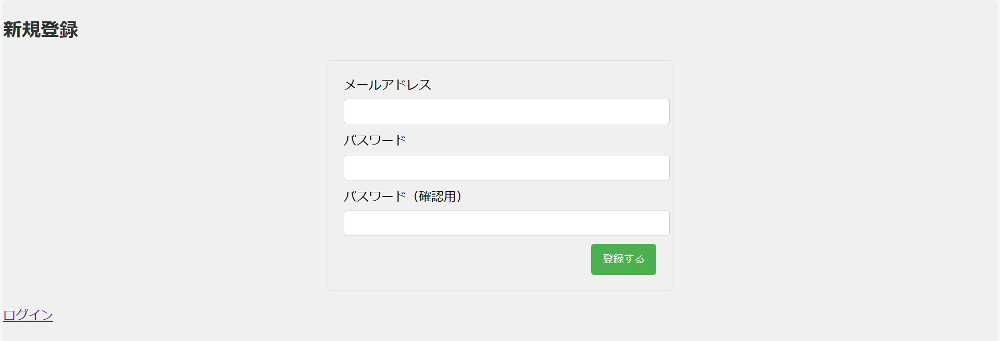

# 野球クイズ

このアプリケーションは、Ruby on Railsを使用して作成されたWebアプリケーションです。ユーザーは、野球に関する様々な質問に回答し、自身のスコアを確認することができます。

## 特徴  
・ユーザーのアカウント作成とログイン  
・野球に関する質問と複数の選択肢を提供  
・選択肢の選択による即時の正解/不正解フィードバック  
・ユーザーごとのスコア計算と表示  
  
## 使用言語  
・Ruby  
・HTML/CSS  
・JavaScript  
  
## 開発環境    
・Ruby 3.2.2  
・Rails 7.1.2  
・SQLite3 (データベース)  
  
## 実行方法  
このWebアプリケーションは現在公開されておらず、ローカル環境でのみ実行可能です。以下の手順に従って、アプリをローカルで実行する方法を説明します。  

## 今後の展望  
・ユーザーからの問題提案：ユーザーが自分で問題を提案できるフォームを導入することで、クイズの多様性と質を高める。  
・ランキング機能の追加：ユーザーのスコアに基づいてランキングを作成することで、より多くのユーザーが参加し、楽しめるようになることを目指す。  
・スコア履歴と推移の追跡：ユーザー認証機能を活用し、各ユーザーのスコアの履歴と推移を記録・表示する機能を導入する。これにより、ユーザーは自身の進歩を確認し、学習の動機付けを高めることができる。  
  
## 前提条件    
アプリケーションを実行する前に、以下のものがシステムにインストールされていることを確認してください。  
・Ruby　3.2.2  
・Rails　7.1.2  
・Git  
・SQLite3（データベース）  
  
## セットアップ手順  
### 1. リポジトリのクローン  
まず、GitHubからこのリポジトリをクローンします。  
```
$ git clone https://github.com/Kanato06/quiz_app.git
```
  
### 2. ディレクトリに移動  
クローンしたリポジトリのディレクトリに移動します。  
```
$ cd quiz_app
```

### 3. 依存関係のインストール  
必要なGemをインストールします。
```
$ bundle install
```

### 4. データベースのセットアップ  
データベースをセットアップします。
```
$ rails db:migrate
```
```
$ rails db:seed
```

### 5. サーバーの起動  
Railsサーバーを起動します。
```
$ rails server
```

### 6. アプリケーションへのアクセス  
ブラウザで 'http://localhost:3000/users/sign_in' にアクセスし、アプリケーションを使用します。
  
## ユーザ登録  
  

  
## ログイン  
  


## クイズ
  


<<<<<<< HEAD
<<<<<<< HEAD
* How to run the test suite

* Services (job queues, cache servers, search engines, etc.)

* Deployment instructions

* ...
=======
# Quiz_app
>>>>>>> b17634330ddd7404641c0f06f7702213ed47fc9a
=======
## 今後の展望  
・ユーザーからの問題提案：ユーザーが自分で問題を提案できるフォームを導入することで、クイズの多様性と質を高める。  
・ランキング機能の追加：ユーザーのスコアに基づいてランキングを作成することで、より多くのユーザーが参加し、楽しめるようになることを目指す。  
・スコア履歴と推移の追跡：ユーザー認証機能を活用し、各ユーザーのスコアの履歴と推移を記録・表示する機能を導入する。これにより、ユーザーは自身の進歩を確認し、学習の動機付けを高めることができる。  
>>>>>>> 0ecaac6769f8ec69204d9293e40cbe3647ed5bd9
=======
>>>>>>> f4af6ef2bcf68461d08648b4d4c625f67b337caf
