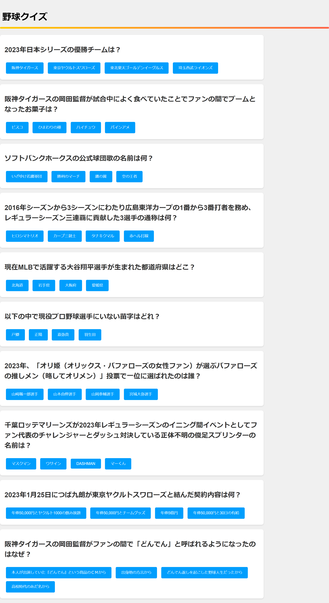

# 野球クイズ

このアプリケーションは、Ruby on Railsを使用して作成されたWebアプリケーションです。ユーザーは、野球に関する様々な質問に回答し、自身のスコアを確認することができます。

## 特徴  
・野球に関する質問と複数の選択肢を提供  
・選択肢の選択による即時の正解/不正解フィードバック  
・ユーザーごとのスコア計算と表示  
  
## 使用言語  
・Ruby  
・HTML/CSS  
・JavaScript  
  
## 開発環境    
・Ruby 3.2.2  
・Rails 7.1.2  
・SQLite3 (データベース)  
  
## 実行方法  
このWebアプリケーションは現在公開されておらず、ローカル環境でのみ実行可能です。以下の手順に従って、アプリをローカルで実行する方法を説明します。  
  
## 前提条件    
アプリケーションを実行する前に、以下のものがシステムにインストールされていることを確認してください。
・Ruby　3.2.2  
・Rails　7.1.2  
・Git  
・SQLite3（データベース）  
  
## セットアップ手順  
1. リポジトリのクローン  
まず、GitHubからこのリポジトリをクローンします。  
```
$ git clone https://github.com/Kanato06/quiz_app.git
```
  
2. ディレクトリに移動  
クローンしたリポジトリのディレクトリに移動します。  
```
$ cd quiz_app
```

3. 依存関係のインストール  
必要なGemをインストールします。
```
$ bundle install
```

4. データベースのセットアップ  
データベースをセットアップします。
```
$ rails db:migrate
```
```
$ rails db:seed
```

5. サーバーの起動  
Railsサーバーを起動します。
```
$ rails server
```

6. アプリケーションへのアクセス  
ブラウザで 'http://localhost:3000' にアクセスし、アプリケーションを使用します。

## スクリーンショット
  

